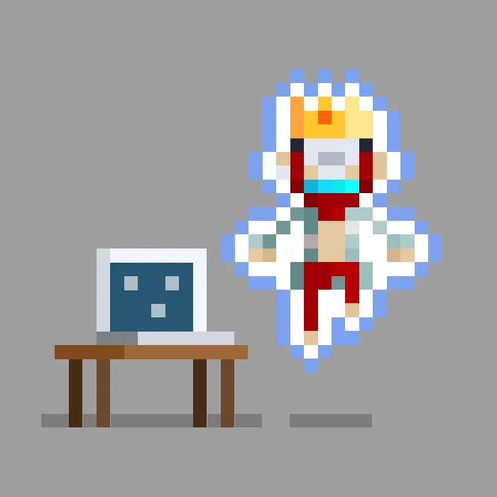

<h1 align="center" width="200px">SEJA BEM VINDO AO MEU PERFIL DO GIT-HUB</h1>

 
 

Sou um desenvolvedor Full-stack

Formado em Desenvolvimento de sistemas - ETEC

Cursando analize e desenvolvimento de sistemas - IFSP

 
 

 

  
  
  
  
  
  
  
  
  
  
  

