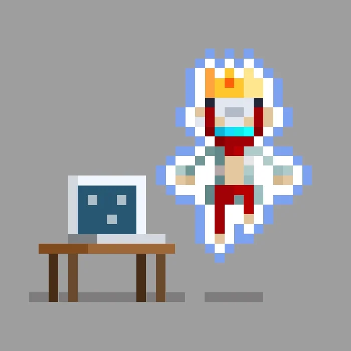

<h3 align="center"> 👋 SEJA BEM-VINDO AO MEU PERFIL DO GitHub </h3>

Aqui compartilho os códigos dos meus projetos pessoais e acadêmicos. Fique à vontade para explorar os repositórios, caso tenha ficado curioso!

- Formado em Desenvolvimento de Sistemas – ETEC
- Cursando Análise e Desenvolvimento de Sistemas – IFSP
 

-----------------

<h4 align="center">Aqui tenho algumas outras redes, caso queira dar uma olhada nos projetos por outro ângulo</h4>

-----------------

 <h3>Conhecimentos:</h3>
  
  
  
  
  
  
  
  
  
  
  

